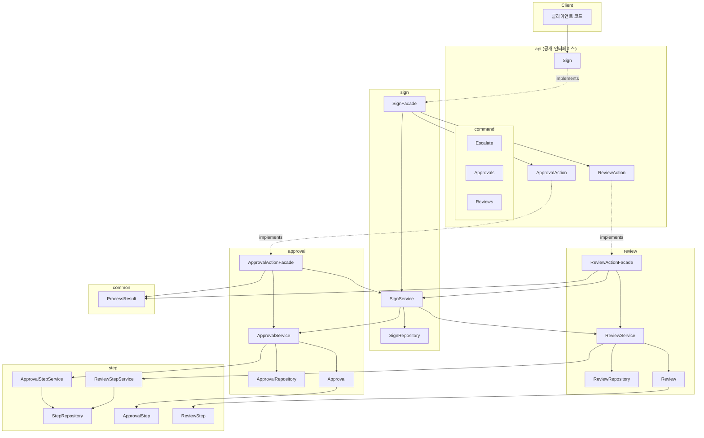
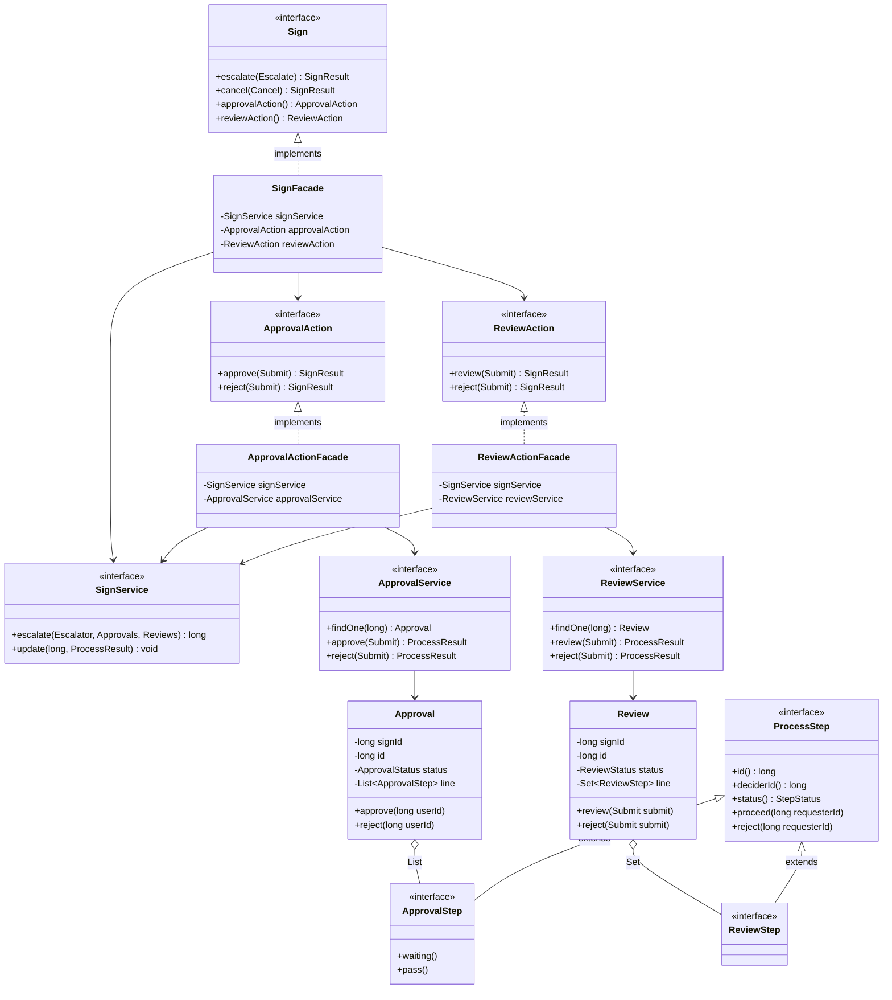
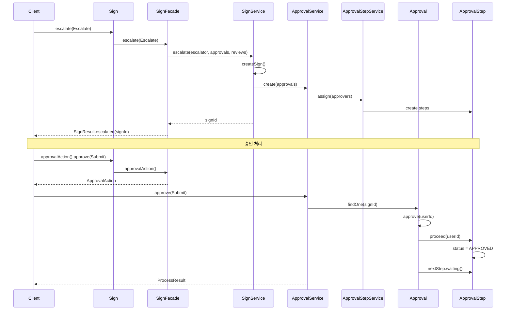
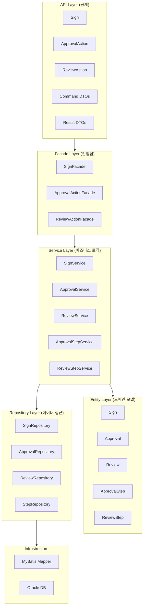
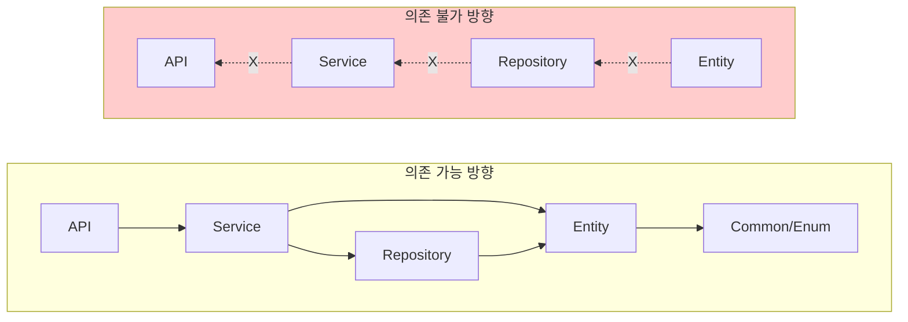
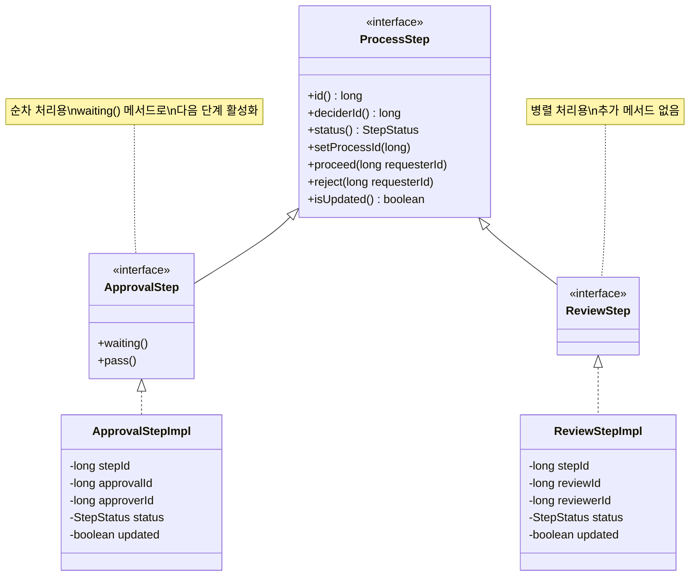
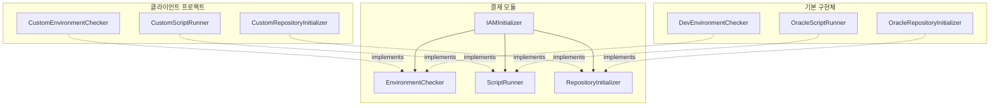

# 의존성 흐름 UML

## 1. 패키지 의존성 다이어그램

---

## 2. 클래스 다이어그램 (핵심 클래스)

---

## 3. 시퀀스 다이어그램 (승인 요청 흐름)

---

## 4. 계층 구조 다이어그램

---

## 5. 의존성 방향 규칙

---

## 6. ProcessStep 계층 구조

---

## 7. 설정 위임 구조

---

## 다이어그램 보는 법

이 문서의 다이어그램은 **Mermaid** 문법으로 작성되었습니다.

**렌더링 방법:**
- GitHub, GitLab: 자동 렌더링
- VS Code: Mermaid 확장 설치
- IntelliJ: Mermaid 플러그인 설치
- 온라인: [Mermaid Live Editor](https://mermaid.live)

**PlantUML 변환이 필요한 경우:**
- [PlantUML 온라인 변환기](https://www.planttext.com) 사용
